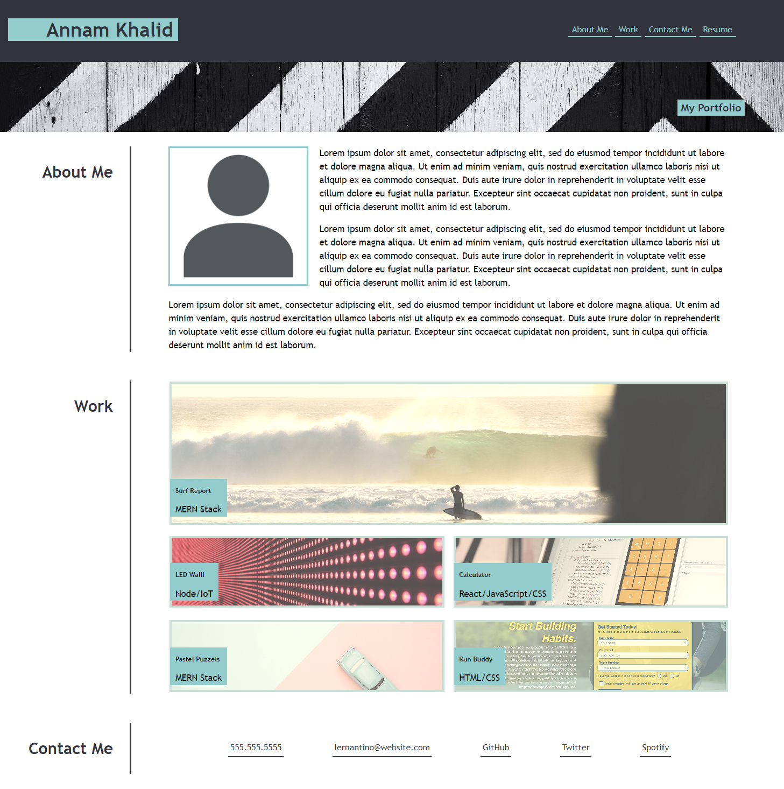

# My-First-Portfilio

## Description

A template portfolio was created for the purpose of showcasing skills acquired throughout the Front-end Web Development Programme. The template was created by implementing recent topics covered within the bootcamp which include; flexbox, media queries, and CSS variables. The portfoilio created was to match the below webpage's apperance and functionality:

## Webpage

The link to my completed webpage [My-First-Portfolio](https://annamkhalid.github.io/My-First-Portfilio/).

## Credits

N/A

## License

Please refer to the LICENSE in the repo.
